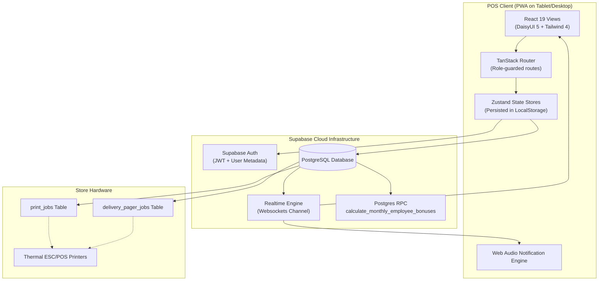
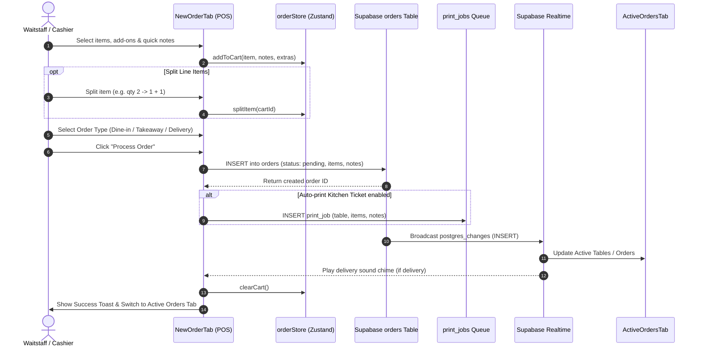
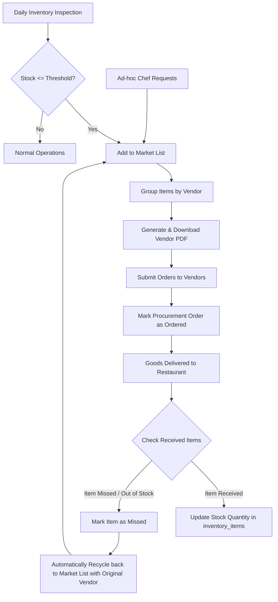
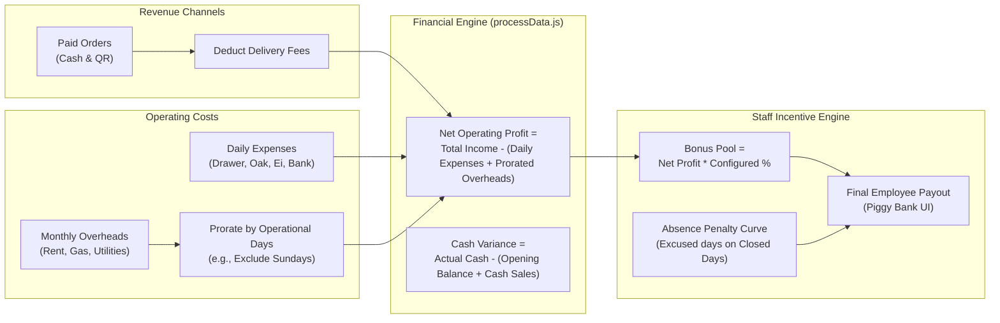

# 🍜 Shal Phyoke Admin (ရှယ်ဖြိုး POS & Restaurant Operations)

A modern, high-performance, tablet-optimized Point of Sale (POS) and Restaurant Operations Management System engineered specifically for **Shal Phyoke**, a bilingual (Burmese & Thai) restaurant operation.

Built with **React 19**, **Vite 7**, **TanStack Router**, **Zustand 5**, **TailwindCSS 4 + DaisyUI 5**, and powered by **Supabase** (PostgreSQL, Auth, Realtime, and RPC).

---

## 📑 Table of Contents

1. [Executive Summary & Domain Context](#-executive-summary--domain-context)
2. [Perspective 1: Software Architect](#-perspective-1-software-architect)
   - [System Architecture Overview](#system-architecture-overview)
   - [Architecture Pattern & Data Flow](#architecture-pattern--data-flow)
   - [Database & Peripheral Integration](#database--peripheral-integration)
   - [Security & Access Control Architecture](#security--access-control-architecture)
   - [Scalability & Resilience Evaluation](#scalability--resilience-evaluation)
3. [Perspective 2: Software Developer](#-perspective-2-software-developer)
   - [Codebase Organization & File Topology](#codebase-organization--file-topology)
   - [State Management Architecture (Zustand Stores)](#state-management-architecture-zustand-stores)
   - [Component Composition & Reusability](#component-composition--reusability)
   - [Date, Timezone, and Locale Handling](#date-timezone-and-locale-handling)
   - [Code Quality & Technical Debt Assessment](#code-quality--technical-debt-assessment)
4. [Perspective 3: Product Manager](#-perspective-3-product-manager)
   - [Core Value Proposition & Operational Fit](#core-value-proposition--operational-fit)
   - [Detailed Feature Matrix & User Journeys](#detailed-feature-matrix--user-journeys)
   - [Business Intelligence & Overhead Amortization](#business-intelligence--overhead-amortization)
   - [Staff Motivation: The Piggy Bank & Profit-Sharing Pool](#staff-motivation-the-piggy-bank--profit-sharing-pool)
5. [Process Workflows & Mermaid Diagrams](#-process-workflows--mermaid-diagrams)
   - [1. End-to-End System Architecture](#1-end-to-end-system-architecture)
   - [2. POS Order Lifecycle & Kitchen Execution](#2-pos-order-lifecycle--kitchen-execution)
   - [3. Procurement & Inventory Feedback Loop](#3-procurement--inventory-feedback-loop)
   - [4. Financial Reconciliation & Bonus Computation](#4-financial-reconciliation--bonus-computation)
6. [Actionable Insights, Roadmap & Engineering Questions](#-actionable-insights-roadmap--engineering-questions)
7. [Local Development & Deployment Guide](#-local-development--deployment-guide)

---

## 🌟 Executive Summary & Domain Context

**Shal Phyoke Admin** is not a generic e-commerce portal or standard CRUD admin panel; it is an ergonomic, kiosk/tablet-first operational terminal running on the restaurant counter.

### Domain-Specific Realities Addressed:
- **Kiosk/Tablet UX**: Global suppression of pull-to-refresh, double-tap zoom, long-press context menus, and text selection, ensuring snappy, native-app-like touchscreen responsiveness (`src/main.jsx` & `src/index.css`).
- **Timezone Invariance**: Operating in Bangkok, Thailand (`Asia/Bangkok`, UTC+7). Day cutoffs, sales windows, hourly traffic graphs, and overhead costs strictly adhere to Bangkok calendar dates regardless of the device's local system timezone.
- **Bilingual & Multi-script Support**: Dual Burmese (`name_burmese`) and English (`name_english`) item naming, custom font embedding (`Myanmar Moe`), and localized Thai driver dispatch messages for delivery riders.
- **Hardware Agnostic Kitchen & Dispatch Printing**: Decoupled asynchronous print queuing via Supabase tables (`print_jobs` and `delivery_pager_jobs`), allowing on-premise thermal printers to consume jobs reliably without blocking browser UI threads.

---

## 🏛 Perspective 1: Software Architect

### System Architecture Overview

```
 ┌────────────────────────────────────────────────────────────────────────┐
 │                     Tablet / Desktop Client (PWA)                      │
 │                                                                        │
 │  ┌─────────────────┐   ┌──────────────────┐   ┌─────────────────────┐  │
 │  │ TanStack Router │   │  Zustand Stores  │   │ React Hook Form/Zod │  │
 │  │  Type-Safe Tree │   │ Persistent Cache │   │  Validation Schema  │  │
 │  └────────┬────────┘   └─────────┬────────┘   └──────────┬──────────┘  │
 │           │                      │                       │             │
 │           └──────────────────────┼───────────────────────┘             │
 │                                  ▼                                     │
 │                      Supabase Client SDK (@2.57)                       │
 └──────────────────────────────────┬─────────────────────────────────────┘
                                    │ HTTPS (REST) & WSS (Realtime)
                                    ▼
 ┌────────────────────────────────────────────────────────────────────────┐
 │                     Supabase BaaS / PostgreSQL                         │
 │                                                                        │
 │  ┌───────────────┐  ┌──────────────────┐  ┌─────────────────────────┐  │
 │  │ Supabase Auth │  │ Postgres Tables  │  │ Postgres RPC Functions  │  │
 │  │  JWT Tokens   │  │ Orders, Menus... │  │ Bonus & Sales Logic     │  │
 │  └───────────────┘  └────────┬─────────┘  └─────────────────────────┘  │
 │                              │                                         │
 │                              ▼ (Realtime Replication / Webhooks)       │
 │                  ┌───────────────────────┐                             │
 │                  │ Print & Pager Queues  │                             │
 │                  │ (print_jobs, pager)   │                             │
 │                  └───────────┬───────────┘                             │
 └──────────────────────────────┼─────────────────────────────────────────┘
                                │ Realtime Subscription / Polling
                                ▼
 ┌────────────────────────────────────────────────────────────────────────┐
 │            Physical Peripherals / Thermal Kitchen Printers             │
 └────────────────────────────────────────────────────────────────────────┘
```

### Architecture Pattern & Data Flow
- **Pattern**: Client-Side Single Page Application (SPA) / Progressive Web App (PWA) operating on a Serverless Backend-as-a-Service (BaaS) model.
- **State Partitioning**:
  - **Local Synchronous State**: Cart status, split item lines, order item notes, night menu toggle, and drafts are managed locally via Zustand with localStorage persistence. This ensures that network hiccups never freeze front-of-house order entry.
  - **Optimistic UI with Debounced Sync**: Inventory stock adjustments (`updateQuantity`) and Market List adjustments (`updateMarketListQuantity`) update local state instantly, buffering changes and flushing them in parallel via a 3-second debounced sync.
  - **Realtime Event Sinks**: Supabase PostgreSQL change subscriptions (`postgres_changes`) keep active orders (`ActiveOrdersTab`), stock items (`InventoryItems`), and delivery alerts (`DeliveryNotificationListener`) synced across multiple terminals concurrently without manual page refreshes.

### Database & Peripheral Integration
- **Relational Integrity**: Core business entities (`menu_items`, `menu_item_extras`, `orders`, `inventory_items`, `vendors`, `procurement_orders`, `procurement_order_items`, `daily_cash`, `daily_expenses`, `monthly_overheads`, `employees`, `employee_absences`, `bonus_config`, `employee_bonus_log`, `quick_notes`).
- **Peripheral Queuing**:
  - `print_jobs`: Incoming dine-in, takeaway, or delivery orders push a structured print payload with item names, quantities, individual item notes, and totals.
  - `delivery_pager_jobs`: Specialized delivery rider slip queues containing parsed delivery addresses, rider license plate numbers, prepaid vs. cash-on-delivery amounts, and Thai driver instructions.

### Security & Access Control Architecture
- **Authentication**: Email/Password authentication via Supabase Auth.
- **RBAC (Role-Based Access Control)**:
  - User roles (`admin` vs `staff`) reside directly in the JWT metadata (`user.user_metadata.role`), eliminating extra roundtrips to user profile tables.
  - Dynamic Permissions: Managed via `app_settings.sidebar_permissions`. Admin users can toggle route visibility for staff accounts directly from the UI (`StaffAccessSettings`).
  - Route Guarding: Hierarchical client protection via `ProtectedRoute` redirects unauthorized staff attempting to access financial summaries (`/dashboard`, `/monthly-overheads`, `/employee-management`, `/staff-access-settings`).

### Scalability & Resilience Evaluation
- **Pros**:
  - Zero heavy server infrastructure to maintain (fully serverless).
  - High availability on front-of-house devices through persistent localStorage caching.
  - Automatic audio-visual alerts notify kitchen and floor staff immediately when online delivery orders arrive.
- **Architectural Bottlenecks / Risks**:
  - *Client-Side Computation*: Business analytics and metrics processing (`processData.js`) run in the browser thread. While blazing fast for daily order counts (< 1,000 orders/day), multi-month aggregations should migrate to server-side Postgres views or edge functions as data accumulates.
  - *Row-Level Security (RLS)*: Client-side routing checks must always be backed by robust PostgreSQL RLS policies to guarantee that sensitive tables (like `monthly_overheads` or `employees`) cannot be queried with a staff JWT directly via the public API.

---

## 💻 Perspective 2: Software Developer

### Codebase Organization & File Topology

```
shal-phyoke-admin/
├── public/
│   ├── fonts/               # Custom Burmese fonts (u_moe.ttf)
│   ├── sounds/              # Audio chimes for delivery notifications (notification-1..5.mp3)
│   ├── manifest.json        # PWA standalone manifest configuration
│   └── sw.js                # Service Worker for offline asset caching
├── src/
│   ├── assets/              # Logos and brand graphics
│   ├── components/
│   │   ├── common/          # Reusable UI widgets (ShalPhyokeDatePicker, Numpad, Modals)
│   │   ├── dashboard/       # Metric cards, charts, and item sales breakdowns
│   │   ├── employees/       # Employee records, Absence logs, Bonus tracker, PiggyBank
│   │   ├── inventory/       # Inventory cards, Stock adjustment modals, Vendor chips
│   │   ├── menu/            # Menu grids, Forms, Availability toggles
│   │   ├── orders/          # NewOrderTab, ActiveOrdersTab, DeliveryPagerModal, Ticket Button
│   │   ├── procurement/     # MarketList, OrderStatus, VendorAccordion, PDF triggers
│   │   ├── ProtectedRoute.jsx
│   │   └── Sidebar.jsx      # Dynamic navigation bar with role filtering & night mode
│   ├── contexts/
│   │   └── AuthContext.jsx  # Supabase session provider and role derivation
│   ├── pages/               # Route-level screens mapped to TanStack Router
│   ├── services/
│   │   ├── supabase.js      # Singleton Supabase client instantiation
│   │   └── printerService.js# Abstraction for inserting print jobs into Supabase
│   ├── stores/              # Zustand state containers
│   │   ├── orderStore.js    # Cart, drafts, split items, notes, calculations
│   │   ├── menuStore.js     # Menu items, extras/add-ons, category filters
│   │   ├── inventoryStore.js# Stock levels, debounced background updates
│   │   ├── procurementStore.js # Market list, vendor orders, missed item recycle
│   │   ├── employeeStore.js # Staff records, wage rates
│   │   ├── employeeAbsenceStore.js # Absence logging and point calculation
│   │   ├── bonusStore.js    # Bonus pool calculation RPC trigger and logs
│   │   ├── quickNoteStore.js# Taste profile and order note presets
│   │   └── staffAccessStore.js # Permission matrix & system settings
│   ├── utils/               # Business logic, calculations, date & sound utilities
│   │   ├── dateUtils.js     # Bangkok timezone anchoring (UTC+7)
│   │   ├── processData.js   # Pure calculation engine for sales, expenses & overheads
│   │   ├── orderUtils.js    # Plaintext clipboard generator for social/chat sharing
│   │   ├── pdfGenerator.js  # jsPDF vendor shopping list generation
│   │   ├── soundUtils.js    # Multi-sound notification player
│   │   └── toastUtils.jsx   # Standardized toast alert wrappers
│   ├── validations/         # Zod schemas for forms (menuSchema, regularMenuSchema)
│   ├── constants.js         # Categories, vendor color palettes, placeholders
│   ├── router.jsx           # TanStack code-based route tree definition
│   ├── App.jsx              # Root shell, theme bindings (bumblebee / dim)
│   ├── main.jsx             # React DOM root, touch event traps & PWA registration
│   └── index.css            # Tailwind 4 imports, DaisyUI config, kiosk CSS overrides
├── package.json
└── vite.config.js
```

### State Management Architecture (Zustand Stores)
The application leverages **Zustand 5** with domain separation. Notable patterns:
1. **`orderStore.js`**:
   - Manages POS cart items keyed by unique `cart_id`.
   - Supports **Split Line Items** (`splitItem`): splits an item with quantity > 1 into distinct individual items so that each can receive a different spice level or taste note.
   - Separate maps for `itemNotes` (`{ cartId: "No spicy" }`) and `itemExtraPrices` (`{ cartId: 20 }`).
   - Draft preservation (`saveCurrentToDraft`, `loadDraft`) enables staff to park a walk-in order while processing a fast takeaway.
2. **`inventoryStore.js` & `procurementStore.js`**:
   - Implements optimistic UI updates with debounced background synchronization (`syncPendingUpdates`).
   - Prevents UI locking when adjusting dozens of stock items on a busy morning delivery check-in.

### Component Composition & Reusability
- **PageHeader Component** (`src/components/common/PageHeader.jsx`): Standardizes title, subtitle, breadcrumb, and primary action buttons across all views.
- **Custom Touch Pickers & Numpads**:
  - `Numpad.jsx`: Large touch-target virtual keypad for entering cash received and expenses without triggering native mobile keyboards.
  - `ShalPhyokeDatePicker.jsx` & `BangkokDatePicker.jsx`: Tablet-friendly date pickers ensuring dates never drift across UTC midnight.

### Date, Timezone, and Locale Handling
All daily metrics are calculated using explicit Bangkok timestamps (`src/utils/dateUtils.js`):
- `toBangkokDateString(date)`: Formats dates as `YYYY-MM-DD` in `Asia/Bangkok` via `Intl.DateTimeFormat`.
- `getBangkokDayRange(date)`: Calculates precise UTC ISO strings for `00:00:00+07:00` and `23:59:59.999+07:00` to ensure database SQL queries query exact business day bounds.

### Code Quality & Technical Debt Assessment

| Area | Current Implementation | Recommendation / Roadmap |
| :--- | :--- | :--- |
| **Type Safety** | JavaScript (`.jsx`, `.js`) with Zod in form schemas | Transition to TypeScript (`.tsx`, `.ts`). Strong types on store states and DB entities will prevent runtime lookup bugs. |
| **Automated Testing** | Zero automated tests | Add **Vitest** for pure calculation tests (`processData.js`, `dateUtils.js`) and **Playwright** for the POS checkout flow. |
| **Hardcoded Constants** | Hardcoded staff names in `paidByOptions` (`Oak`, `Ei`) | Store payment payer accounts dynamically in a database table or `app_settings`. |
| **Component Granularity** | `ActiveOrdersTab.jsx` (>1,000 lines) and `NewOrderTab.jsx` (>800 lines) | Decompose into smaller subcomponents (e.g. `TableGroupCard`, `OrderSummaryPane`, `CartItemList`). |
| **Error Handling** | Supabase errors trigger toasts | Add an overarching React Error Boundary to catch render exceptions and prevent POS screen blackouts during shifts. |

---

## 📊 Perspective 3: Product Manager

### Core Value Proposition & Operational Fit
Shal Phyoke Admin is custom-built to streamline front-of-house ordering, kitchen dispatch, inventory restocking, and financial accounting for a fast-paced Southeast Asian restaurant. It replaces fragmented paper slips, third-party spreadsheets, and unintegrated POS terminals with a single unified touch-screen interface.

### Detailed Feature Matrix & User Journeys

```
 ┌───────────────────────────────────────────────────────────────────────────┐
 │                           Operational Domains                             │
 ├───────────────────┬───────────────────┬───────────────────┬───────────────┤
 │  Front-of-House   │ Kitchen & Drivers │ Supply & Storage  │  Management   │
 │       (POS)       │    (Fulfillment)  │   (Procurement)   │   (Finance)   │
 ├───────────────────┼───────────────────┼───────────────────┼───────────────┤
 │ • Menu Navigation │ • Active Tables   │ • Low-stock alerts│ • Net Profit  │
 │ • Night Mode      │ • Kitchen Tickets │ • Vendor grouping │ • Daily Cash  │
 │ • Add-on Upcharge │ • Delivery Pager  │ • PDF PO export   │ • Overheads   │
 │ • Split Lines     │ • Order status    │ • Missed items    │ • Piggy Bank  │
 │ • Draft Orders    │ • Chime Alerts    │ • Stock counts    │ • Permissions │
 └───────────────────┴───────────────────┴───────────────────┴───────────────┘
```

#### User Flow 1: Front-of-House Walk-in & Dining In
1. Staff selects dishes from categorised tabs (Salad, Rice, Noodles, Drinks, Combos).
2. If an item has add-ons (e.g. extra meat, egg), the `AddonSelectionModal` automatically prompts for selection with associated prices.
3. Quick notes (spiciness level, sweetness, "no coriander") are applied directly to the line item.
4. Staff assigns Table Number via `TableSelectionModal` and confirms Dine-in.
5. Ticket is printed to the kitchen queue, and table appears on `ActiveOrdersTab` showing elapsed time and cumulative unpaid totals.

#### User Flow 2: Third-Party Delivery Dispatch
1. An incoming delivery order triggers a distinct audio chime on the tablet via `DeliveryNotificationListener`.
2. Kitchen prepares order items.
3. Front staff opens `DeliveryPagerModal`:
   - Pastes dispatch text directly from delivery apps (e.g. Grab, Lineman, Lalamove). The modal automatically parses vehicle plate number and destination address.
   - Chooses driver instruction mode: **Drop Off** (`วางไว้ที่จุดรับส่งอาหาร ตึก...`) or **Call Customer** (`ถึงแล้วโทรหา...`).
   - Calculates COD vs Prepaid amount.
   - Enqueues delivery slip for instant thermal printing.

#### User Flow 3: Morning Stock Check & Supplier Procurement
1. Floor manager checks `InventoryItems` screen. Low stock items are highlighted in red.
2. Manager clicks "Add to Market List".
3. In `Procurement`:
   - Items are automatically categorized by vendor (e.g., Makro, Fresh Market, Beverage Distributor).
   - Generates and downloads branded PDF purchase orders via `jsPDF`.
   - Confirms order to move items into `procurement_orders`.
4. When goods arrive:
   - Manager checks off received quantities.
   - Any missing or unavailable items are marked as "Missed" and **automatically re-queued into the active Market List** linked to the original vendor.

### Business Intelligence & Overhead Amortization
Unlike naive accounting systems that divide monthly expenses by 30 days, Shal Phyoke's financial engine (`processData.js`) uses **Operational Day Amortization**:
$$\text{Daily Overhead Cost} = \begin{cases} \frac{\sum \text{Monthly Overheads}}{\text{Total Operational Days in Month}} & \text{if Today is an Operational Day} \\ 0 & \text{if Restaurant is Closed} \end{cases}$$
- **Operational Days**: Configurable (e.g., Monday through Saturday; Sundays closed).
- **Daily Cash Variance**: Reconciles physical cash drawer collections against expected cash:
$$\text{Expected Cash} = \text{Opening Balance} + \text{Cash Sales}$$
$$\text{Variance} = \text{Cash Collected} - \text{Expected Cash}$$

### Staff Motivation: The Piggy Bank & Profit-Sharing Pool
To retain talent and align employee performance with business profitability:
1. **Profit Pool**: An automated percentage of net operating profit (e.g., 10%) is allocated into a communal employee bonus pool via Postgres RPC `calculate_monthly_employee_bonuses`.
2. **Dynamic Penalty Curve**: Staff receive unexcused absence points. Configurable penalty tiers reduce individual bonus payouts (e.g., 2 points = -50%, 3 points = -75%, 4 points = -100%).
3. **The "Piggy Bank" UI**: Staff can view the team's growing bonus pool in real time, making business success transparent and communal.

---

## 🔄 Process Workflows & Mermaid Diagrams

### 1. End-to-End System Architecture



---

### 2. POS Order Lifecycle & Kitchen Execution



---

### 3. Procurement & Inventory Feedback Loop



---

### 4. Financial Reconciliation & Bonus Computation



---

## 🎯 Actionable Insights, Roadmap & Engineering Questions

### High-Priority Architectural Recommendations:
1. **Migrate to TypeScript**: The complex data shapes of orders, extra prices, combo slot selections, and financial calculations will benefit immensely from strict type definitions, eliminating runtime errors.
2. **Implement Automated End-to-End & Unit Tests**:
   - Unit tests for `processData.js` (financial calculations and day-count amortizations).
   - Integration tests for `orderStore` (cart operations, item splits, draft lifecycle).
   - E2E tests for the POS checkout flow using Playwright.
3. **Database-Backed Enums and Settings**:
   - Replace hardcoded expense payers (`Oak`, `Ei`) and categories with a database table or managed app settings to avoid code changes when staff members change.
4. **Offline Mode & Sync Resilience**:
   - While Zustand caches drafts locally, integrating TanStack Query (React Query) with persistent offline storage or Dexie.js (IndexedDB) would allow full offline order capture during total internet blackouts, syncing back to Supabase upon reconnection.

### Strategic Questions for Stakeholders:
1. **Multi-Terminal Concurrency**: If two cashiers edit table orders at the exact same second, should the system implement PostgreSQL row-level locks or conflict-resolution prompts?
2. **Customer-Facing Kiosk / QR Self-Ordering**: Can the existing `menuStore` and `orderStore` be exposed to customer smartphones via QR codes at dining tables to offload waitstaff during rush hours?
3. **Automated Supplier Integrations**: Would connecting the procurement module directly to supplier APIs (or automated LINE Notify messages) save time compared to manual PDF downloads?

---

## 🛠 Local Development & Deployment Guide

### Prerequisites
- **Node.js**: Version `20.19+` or `22.12+` (Required by Vite 7).
- **Package Manager**: `npm` or `pnpm`.
- **Supabase Account**: A configured Supabase project with database schema and RPC functions.

### Environment Variables
Create a `.env` file in the project root:
```env
VITE_SUPABASE_URL=https://your-project-id.supabase.co
VITE_SUPABASE_PUBLISHABLE_KEY=your-supabase-publishable-key
```

### Installation & Execution
```bash
# 1. Install dependencies
npm install

# 2. Start development server
npm run dev

# 3. Build for production
npm run build

# 4. Preview production build locally
npm run preview
```

### Production Deployment
The project includes a `netlify.toml` configuration and redirects file (`public/_redirects`) optimized for Single Page Application routing on **Netlify**, **Vercel**, or **Cloudflare Pages**.
